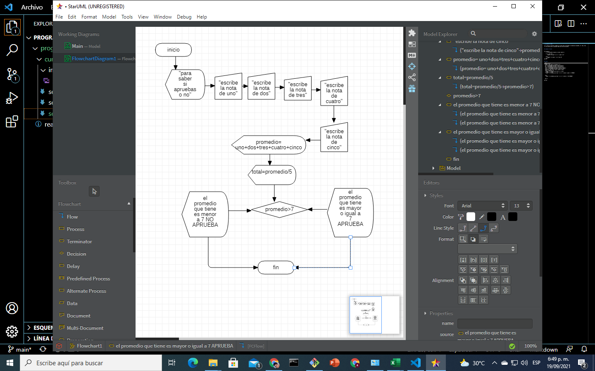

# septiembre 13 2021

en la clase el instructor trabajo con visual basic utilizando la combinacion InputBox, If, Then, Else la cual permite que el programa tenga una serie de opciones


## ejemplo en excel

```
Sub ejemplo()
    n = Int(InputBox("ingrese el primer numero"))

    If (n > 10) Then
        MsgBox"n es mayor" & n & " o igual e 10 "
    
    Else
        MsgBox" n es menor " & n &" que 10"
    End If
End Sub
```

## tarea

```
Sub ejercicio()
  MsgBox " para saber si apruebas o no "
  uno = Int(InputBox("escribe la nota de uno"))
  dos = Int(InputBox("escribe la nota de dos"))
  tres = Int(InputBox("escribe la nota de tres"))
  cuatro = Int(InputBox("escribe la nota de cuatro"))
  cinco = Int(InputBox("escribe la nota de cinco"))
  sumatoria = uno + dos + tres + cuatro + cinco
  Total = sumatoria / 5
    MsgBox " el promedio que tines es " & Total
  If (Total > 7) Then
    MsgBox " el promedio que tiene " & n & " es mayor o igual a 7 APRUEBA"
    
  
  Else
    MsgBox " el promedio que tiene " & n & " es menor a 7 NO APRUEBA"
    
    
  End If
  
End Sub
```


