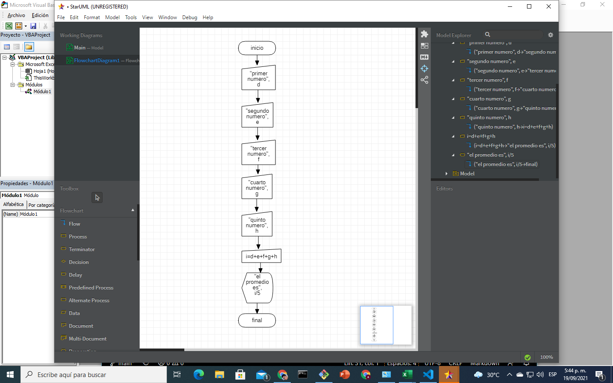

# septiembre-9-2021

en la clase el instructor utilizo los escenarios StarUML y excel visual basic, utilizando los comandos MsgBox y InputBox, combinandolos para pedirle al usuario que digite informacion

## ejemplo en excel

```
Sub ejemplo ()
    a = InputBox("digite primer numero")
    b = InputBox("digite segundo numero")
    c = a + b
    MsgBox "la suma es" & c
End Sub
```

## tarea 

```
Sub practica()
    d = InputBox("primer numero")
    e = InputBox("segundo numero")
    f = InputBox("tercer numero")
    g = InputBox("cuarto numero")
    h = InputBox("quinto numero")
    i = Int(d) + Int(e) + Int(f) + Int(g) + Int(h)
    MsgBox "el promedio es" & i / 5
    
End Sub
```
## tarea diagrama de flujo en StarUML

